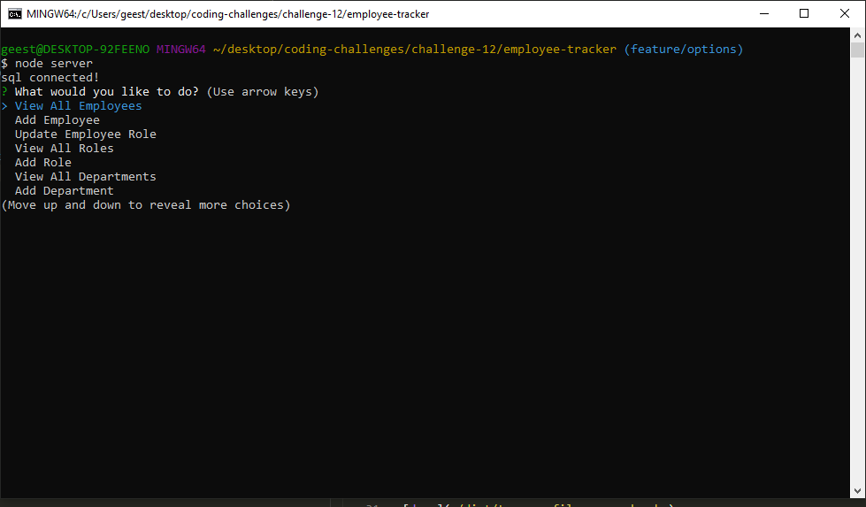

# Employee Tracker

## Intent

This application allows users to manage their employees position title, salary, department, and manager with just a few clicks!!

## Installation 

In order to successfully utilize this app, a user will need to install npm mysql2, inquirer, dotenv, and console.table.

## Built With 

* NodeJs

* SQL

* JS

## Example 

## Demonstration Link 

[demo](https://drive.google.com/file/d/1PecGg1YtUBLjw0j5zkjBiyvVpa7rBWZ7/view)